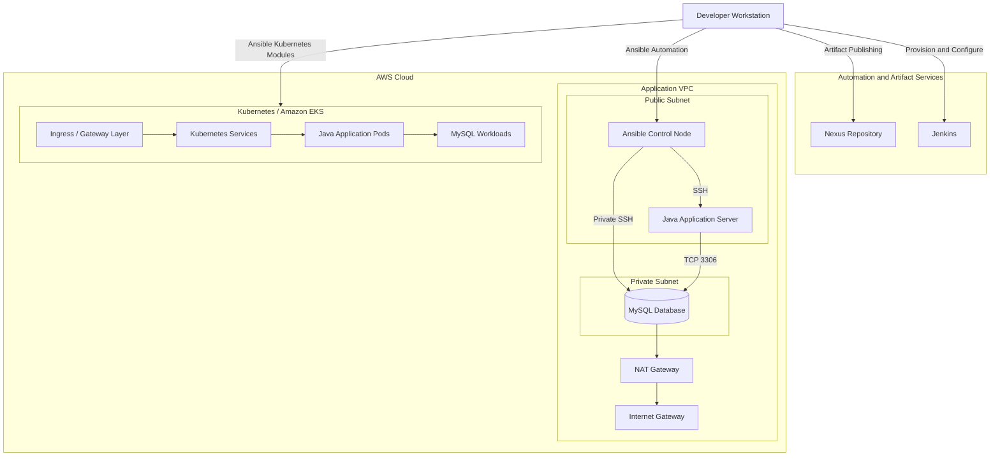
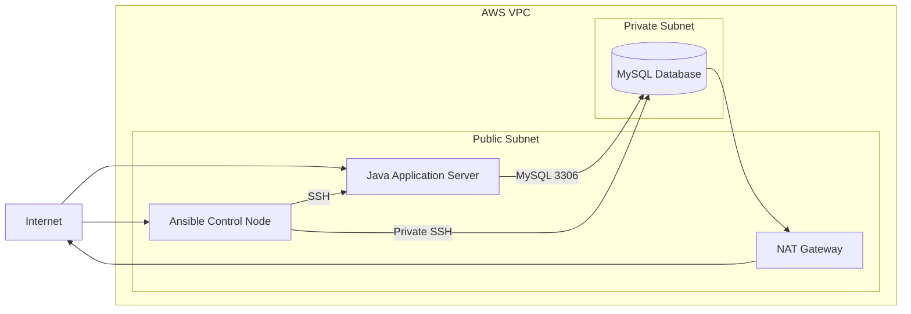
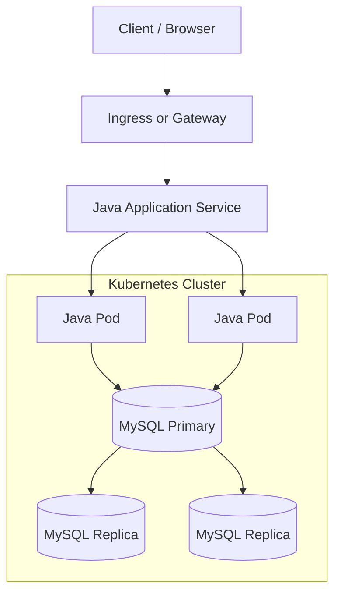

# Ansible Configuration Management Platform

Production-oriented infrastructure configuration and application deployment automation using Ansible across AWS, Linux, Docker, Jenkins, Nexus, MySQL, Kubernetes, and Helm.

## Overview

This project demonstrates how Ansible can be used as a centralized configuration management and deployment automation platform for both traditional server-based infrastructure and cloud-native environments.

The platform automates infrastructure configuration, application delivery, artifact publishing, Jenkins provisioning, Docker-based workloads, private AWS networking, database configuration, and Kubernetes deployments.

The implementation emphasizes:

- repeatable configuration
- idempotent automation
- reusable Ansible roles
- dynamic cloud inventory
- secure secret handling
- infrastructure isolation
- multi-platform support
- automated application deployment
- validation and operational consistency

---

## Architecture



---

## Technology Stack

| Area | Technology |
|---|---|
| Configuration Management | Ansible |
| Cloud Platform | AWS |
| Compute | Amazon EC2 |
| Networking | VPC, Public/Private Subnets, Internet Gateway, NAT Gateway |
| CI/CD | Jenkins |
| Artifact Repository | Nexus Repository |
| Containers | Docker |
| Container Orchestration | Kubernetes / Amazon EKS |
| Kubernetes Package Management | Helm |
| Application Build | Gradle |
| Application Runtime | Java |
| Database | MySQL |
| Automation SDK | Python, boto3, botocore |
| Source Control | Git, GitHub, GitLab |

---

## Repository Structure

```text
.
├── app/
│   ├── Dockerfile
│   └── README.md
│
├── inventories/
│   ├── exercise-01/
│   ├── exercise-03/
│   ├── exercise-04/
│   └── exercise-06/
│
├── playbooks/
│   ├── 01-build-and-deploy-java.yml
│   ├── 02-push-artifact-to-nexus.yml
│   ├── 03-provision-jenkins-ec2.yml
│   ├── 03-install-jenkins-amazon-linux.yml
│   ├── 04-install-jenkins-multi-os.yml
│   ├── 05-install-jenkins-docker.yml
│   ├── 06-provision-network-and-control.yml
│   ├── 06-configure-ansible-control.yml
│   ├── 06-provision-app-servers.yml
│   ├── 06-configure-app-servers.yml
│   ├── 07-deploy-java-mysql-k8s.yml
│   └── 08-deploy-mysql-helm.yml
│
├── roles/
│   ├── docker_engine/
│   ├── java_app/
│   ├── jenkins_amazon_linux/
│   ├── jenkins_common/
│   └── jenkins_ubuntu/
│
├── tasks/
│   ├── jenkins-amazon-linux.yml
│   └── jenkins-ubuntu.yml
│
├── vars/
│   ├── exercise-06.yml.example
│   ├── exercise-07.yml.example
│   └── exercise-08.yml.example
│
├── kubernetes/
│   ├── exercise-07/
│   └── exercise-08/
│
├── generated/
│
├── scripts/
│   ├── bootstrap-macos.sh
│   └── bootstrap-digitalocean.sh
│
├── docs/
│   ├── architecture.md
│   ├── security.md
│   └── troubleshooting.md
│
├── ansible.cfg
├── requirements.yml
├── requirements.txt
├── .gitignore
└── README.md
```

---

# Implemented Automation Workflows

## Java Artifact Build and Deployment

Ansible builds a Java application locally using Gradle and deploys the generated JAR artifact to a remote Ubuntu server.

The workflow:

```text
Gradle Build
    ↓
Artifact Validation
    ↓
Linux User Creation
    ↓
Stop Existing Application
    ↓
Remove Previous JAR
    ↓
Deploy New Artifact
    ↓
Start Java Application
    ↓
Application Validation
```

The application runs under a dedicated non-root Linux user.

---

## Nexus Artifact Publishing

Successfully tested Java artifacts can be published automatically to a Nexus Maven repository.

The workflow supports:

- configurable Nexus repository URL
- configurable artifact name and version
- runtime authentication
- artifact existence validation
- automated upload using Ansible

Credentials are not stored in the repository.

---

## Jenkins Provisioning on AWS

Ansible provisions and configures Jenkins servers dynamically on Amazon EC2.

The Jenkins environment includes:

- Jenkins
- Java
- Node.js
- npm
- Docker
- Git

AWS resources are identified using tags and dynamic inventory rather than hardcoded IP addresses.

---

## Multi-OS Jenkins Configuration

Jenkins configuration supports multiple Linux distributions, including:

```text
Amazon Linux
Ubuntu
```

Ansible facts determine the target operating system and load the appropriate configuration automatically.

This reduces duplicated configuration and provides a reusable deployment pattern across infrastructure platforms.

---

## Jenkins as a Docker Container

Jenkins can also be deployed as a persistent Docker container using Ansible.

The deployment provides:

- Jenkins web interface on port `8080`
- Jenkins agent communication on port `50000`
- persistent Jenkins home storage
- Docker CLI integration
- Docker daemon access for build workloads

The Docker socket configuration is intended for controlled lab environments because access to `/var/run/docker.sock` provides privileged access to the Docker host.

---

# AWS Multi-Tier Infrastructure

The project includes automation for a traditional Java and MySQL deployment architecture on AWS.

```text
AWS VPC
│
├── Public Subnet
│   ├── Ansible Control Node
│   └── Java Application Server
│
└── Private Subnet
    └── MySQL Database Server
```

The database server:

- has no public IP address
- resides in a private subnet
- receives database traffic only from permitted application resources
- uses a NAT Gateway for outbound package installation and updates

The Ansible control node manages application and database configuration from within the VPC.

---

## Private Database Architecture



---

# Kubernetes Deployment

The containerized Java and MySQL application can also be deployed to Kubernetes using Ansible Kubernetes modules.

The deployment includes:

- Namespace
- ConfigMap
- Kubernetes Secrets
- MySQL workload
- MySQL Service
- Java Deployment
- Java Service
- external application routing

Application and database credentials are created dynamically and are not stored as plaintext Kubernetes manifests in the repository.

---

## Kubernetes Architecture



---

## Helm-Based MySQL Deployment

The Kubernetes database deployment can be upgraded from a single MySQL instance to a Helm-managed replicated architecture.

The target database topology is:

```text
MySQL Primary
├── Secondary Replica
└── Secondary Replica
```

Helm provides a reusable application package and release-management workflow for managing the database deployment.

---

# Ansible Roles

Reusable configuration logic is separated into Ansible roles.

Examples include:

```text
roles/
├── docker_engine/
├── java_app/
├── jenkins_amazon_linux/
├── jenkins_common/
└── jenkins_ubuntu/
```

Roles provide separation between:

- tasks
- default variables
- reusable configuration
- platform-specific logic
- application deployment logic

Third-party roles are declared through `requirements.yml` instead of being permanently vendored into the repository.

Install required collections and roles with:

```bash
ansible-galaxy install -r requirements.yml
```

---

# Dynamic Inventory

AWS environments use Ansible's EC2 dynamic inventory plugin.

This eliminates the need to maintain hardcoded server IP addresses.

Resources can be discovered using:

- AWS regions
- EC2 tags
- instance state
- instance attributes
- private and public addresses

Example validation:

```bash
ansible-inventory \
  -i inventories/exercise-06/inventory_aws_ec2.yml \
  --graph
```

---

# Security

Security controls are built into the repository structure and deployment workflow.

The following must never be committed:

```text
AWS access keys
AWS secret keys
AWS session tokens
SSH private keys
PEM files
Docker registry tokens
Nexus credentials
MySQL passwords
Kubernetes Secret values
kubeconfig files
Ansible Vault passwords
Terraform state files containing sensitive information
.env files containing credentials
```

Sensitive values should be provided through secure mechanisms such as:

- Ansible Vault
- AWS IAM roles
- environment variables
- Jenkins Credentials
- CI/CD secret stores
- external secret-management platforms

Infrastructure security measures include:

- dedicated application users
- SSH key authentication
- private database subnet
- no public IP address on the database server
- security-group based access control
- restricted inbound ports
- least-privilege access where practical

See:

```text
docs/security.md
```

for additional security documentation.

---

# Prerequisites

The control workstation requires:

- Python 3
- pip
- Ansible
- Git
- AWS CLI
- boto3
- botocore
- Docker
- kubectl
- Helm

Some workflows additionally require:

- Java
- Gradle
- access to an AWS account
- access to Nexus Repository
- access to a Kubernetes cluster

---

# Local Setup

Clone the repository:

```bash
git clone git@github.com:younghadiz/ansible-configuration-management-platform.git

cd ansible-configuration-management-platform
```

Create a Python virtual environment:

```bash
python3 -m venv .venv
```

Activate it:

```bash
source .venv/bin/activate
```

Upgrade pip:

```bash
python3 -m pip install --upgrade pip
```

Install Python dependencies:

```bash
pip install -r requirements.txt
```

Install required Ansible collections and roles:

```bash
ansible-galaxy install -r requirements.yml
```

---

# Verify Installation

Check Ansible:

```bash
ansible --version
```

Check installed collections:

```bash
ansible-galaxy collection list
```

Check installed roles:

```bash
ansible-galaxy role list
```

---

# Running Playbooks

Playbooks are stored in:

```text
playbooks/
```

Validate a playbook before execution:

```bash
ansible-playbook \
  --syntax-check \
  playbooks/<playbook-name>.yml
```

Run with a static inventory:

```bash
ansible-playbook \
  -i inventories/<inventory-file> \
  playbooks/<playbook-name>.yml
```

Run with AWS dynamic inventory:

```bash
ansible-playbook \
  -i inventories/exercise-06/inventory_aws_ec2.yml \
  playbooks/<playbook-name>.yml
```

---

# Validation

## Ansible

Validate syntax:

```bash
ansible-playbook \
  --syntax-check \
  playbooks/<playbook-name>.yml
```

Validate inventory:

```bash
ansible-inventory \
  -i inventories/<inventory-file> \
  --graph
```

Run Ansible lint:

```bash
ansible-lint .
```

---

## Java Application

```bash
curl http://localhost:8080
```

Check Java process:

```bash
ps aux | grep java
```

---

## Docker

```bash
docker ps
```

Inspect Jenkins container:

```bash
docker inspect jenkins
```

Check persistent volumes:

```bash
docker volume ls
```

---

## Jenkins

```bash
systemctl status jenkins
```

For Docker-based Jenkins:

```bash
docker ps --filter name=jenkins
```

---

## Kubernetes

```bash
kubectl get all -n java-mysql
```

Check services:

```bash
kubectl get svc -n java-mysql
```

Check workloads:

```bash
kubectl get pods -n java-mysql
```

Check ingress or external routing:

```bash
kubectl get ingress -n java-mysql
```

---

## Helm

```bash
helm list -n java-mysql
```

Inspect deployed release:

```bash
helm status mysql -n java-mysql
```

---

# Git Workflow

Development follows a structured branching workflow:

```text
main
  ↑
develop
  ↑
feature/*
```

`main` contains production-ready project history.

`develop` is the integration branch for completed features.

Individual implementation stages are developed on dedicated feature branches.

Example:

```bash
git checkout develop

git checkout -b feature/exercise-01-java-deployment
```

Completed features are merged using:

```bash
git checkout develop

git merge --no-ff feature/exercise-01-java-deployment
```

Using `--no-ff` preserves feature-level history in the Git graph.

The repository is mirrored to both GitHub and GitLab.

Push to GitHub:

```bash
git push origin develop
```

Push to GitLab:

```bash
git push gitlab develop
```

---

# Engineering Practices

This repository applies the following engineering practices:

- infrastructure and configuration as code
- idempotent automation
- reusable Ansible roles
- environment-aware variables
- dynamic AWS inventory
- separation of public and private infrastructure
- secret exclusion from source control
- non-root application execution
- multi-platform configuration
- automated deployment validation
- declarative Kubernetes resources
- Helm-based application lifecycle management
- structured Git branching
- dual GitHub and GitLab repository hosting

---

# Documentation

Additional project documentation is available under:

```text
docs/
├── architecture.md
├── security.md
└── troubleshooting.md
```

---

## Repository Mirrors

GitHub:

```text
https://github.com/younghadiz/ansible-configuration-management-platform
```

GitLab:

```text
https://gitlab.com/devops-engineering-projects/ansible-configuration-management-platform
```

---

## License

This repository is intended for demonstration, learning, infrastructure automation practice, and DevOps portfolio use.